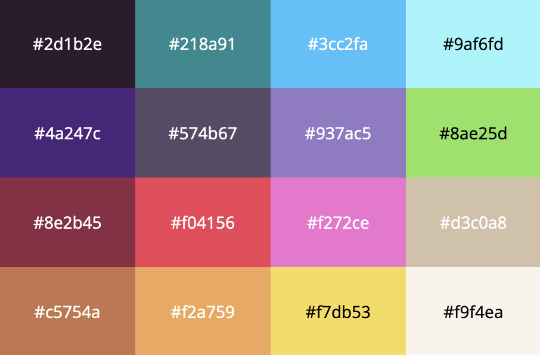

# pixelfuck

> ⚠️ This is in early stages of development ⚠️\
> Write programs for a pixel display ❤️.

## Specifications

The programs can be written in a stack-based variant of
[brainfuck](https://en.wikipedia.org/wiki/Brainfuck) 🤬 that I
named **pixelfuck**. The operations are performed on a stack
while the output can be displayed in a $16 \times 16$ grid of
virtual pixels 🚨.

#### Colours

The LEDs can range from `0` to `F` in hexadecimal, mapped to the
[castpixel-16](https://lospec.com/palette-list/castpixel-16)
color palette from top to bottom, left to right.

Since the memory cells are 8-bits wide, the highest 4 bits will
be used for colour transparency. The lowest 4 bits will be used
for the colour index. For example, `0x0F` is the color `F` with
no transparency (which means is 100% visible), while `0x8E` is
the color `E` with `8 / 16` transparency (which means is only
50% visible). If you want to use a solid colour just after the
grid has been prepared / reset, you won't need to set a full
byte, you can just set the lowest 4 bits like this: `E`.

The display will be updated on every output operation (`.`).
Display memory wraps around.
Any program running for more than 5 seconds will be stopped.

To allow for faster and cooler programs, there are a few extra
features allowed as a language extension:

|**C**| **Meaning**                                        |
|:---:|:---------------------------------------------------|
|<code>`</code>| Duplicate stack top.                      |
| `°` | Push stack top colour into current cell.           |
| `,` | Push 0 onto the stack.                             |
| `.` | Sets the current cell to the specified value.      |
| `:` | Push value onto the stack.                         |
| `;` | Output a frame on the display.                     |
| `?` | Pushes current cell colour onto the stack.         |
| `"` | Increment stack top.                               |
| `'` | Decrement stack top.                               |
| `+` | Pops twice and pushes the addition result.         |
| `-` | Pops twice and pushes the subtraction result.      |
| `*` | Pops twice and pushes the multiplication result.   |
| `/` | Pops twice and pushes the division result.         |
| `%` | Pops twice and pushes the modulus result.          |
| `&` | Pops twice and pushes the and result.              |
| `\|`| Pops twice and pushes the or result.               |
| `!` | Flip the current stack top value.                  |
| `@` | Set delay for the next frames to stack top.        |
| `$` | Pops and discards the top stack value.             |
| `#` | Pops and sets the current cell pointer.            |
| `=` | Pops and sets the current cell data.               |
| `<` | Move display tape head left ($x - 1$).             |
| `>` | Move display tape head right ($x + 1$).            |
| `^` | Move display tape head up ($y - 1$).               |
| `_` | Move display tape head down ($y + 1$).             |
| `[` | Jump past matching `]` if stack top holds `0`.     |
| `]` | Jump back to matching `[` if stack top is not `0`. |
| `\` | Resets the whole grid to the values `F0`.          |
| `§` | Halt the program early.                            |

For practical reasons, you can loop with `()`, `[]` and `{}`.

#### Data and Pointer Manipulation

You can set a cell to a specific value by using `.` which will
pop the value off the stack and set it in the current cell.
For example, `0F.` will set the current cell to `15`. This is
done through subsequent 4 bit **shifts** and **or** operations.

You can manipulate the current cell pointer by subfixing the
hexadecimal pointer with `#`. For example, `A0:#` will set the
current cell pointer to `[ 10, 0 ]` where the first value is
the `x` coordinate and the second value is the `y` coordinate.
The display position `[ 0, 0 ]` is the top left corner.

#### Delay and Output

The delay operator `@` can be used to set the delay between
frames. The delay is a hexadecimal value from `0` to `F` and
it will be multiplied by `200ms`. For example, `F:@` will set
the delay to `3.2s`.
